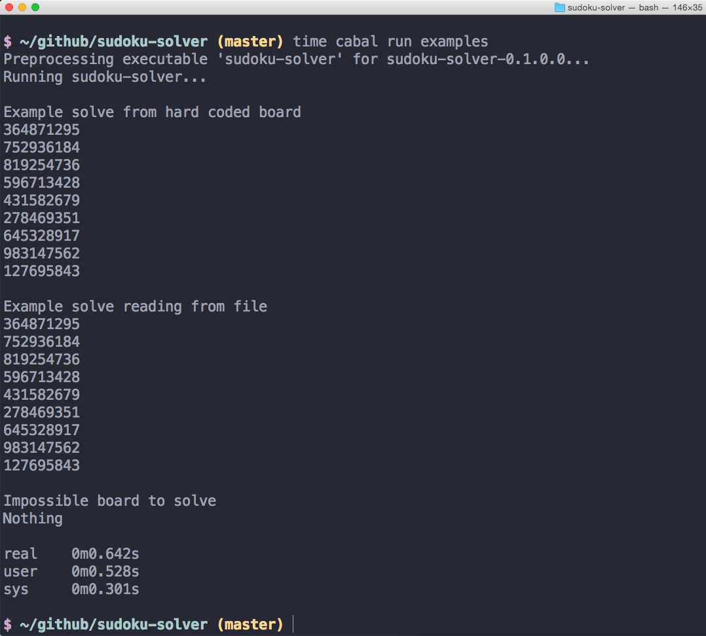
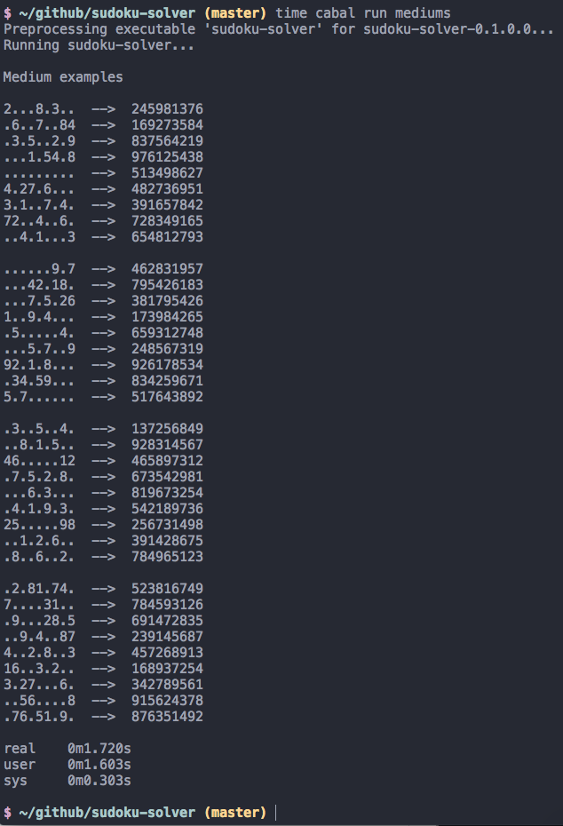
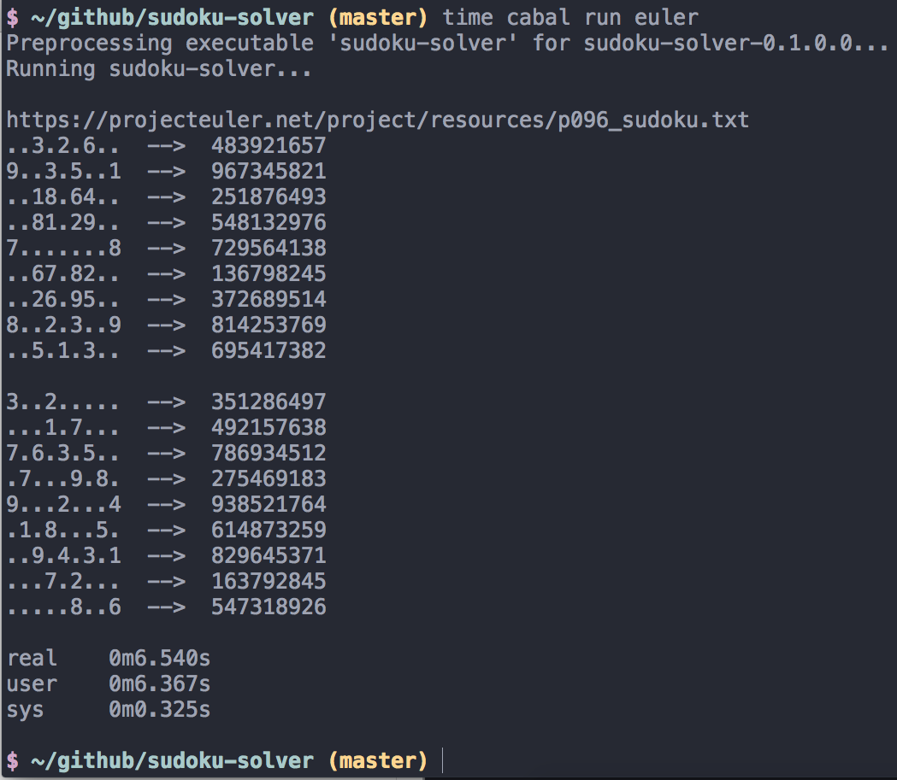

#Sudoku Solver 

:pencil: A simple Sudoku solving AI written in Haskell. 

##Usage

##Colophon

I used [this assignment sheet](http://www.cse.chalmers.se/edu/year/2014/course/TDA555/lab3.html) for a general outline on steps to follow

I used [these test sudokus](https://github.com/rohanp/sudoku)